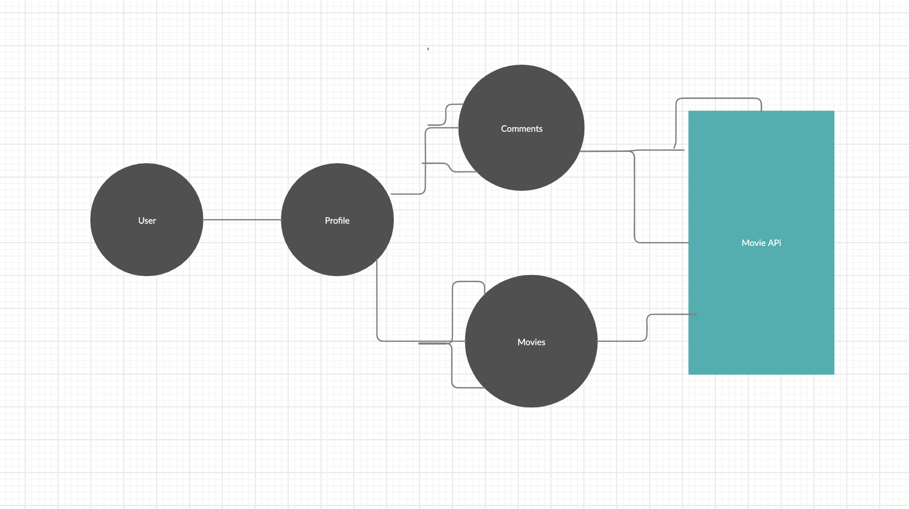
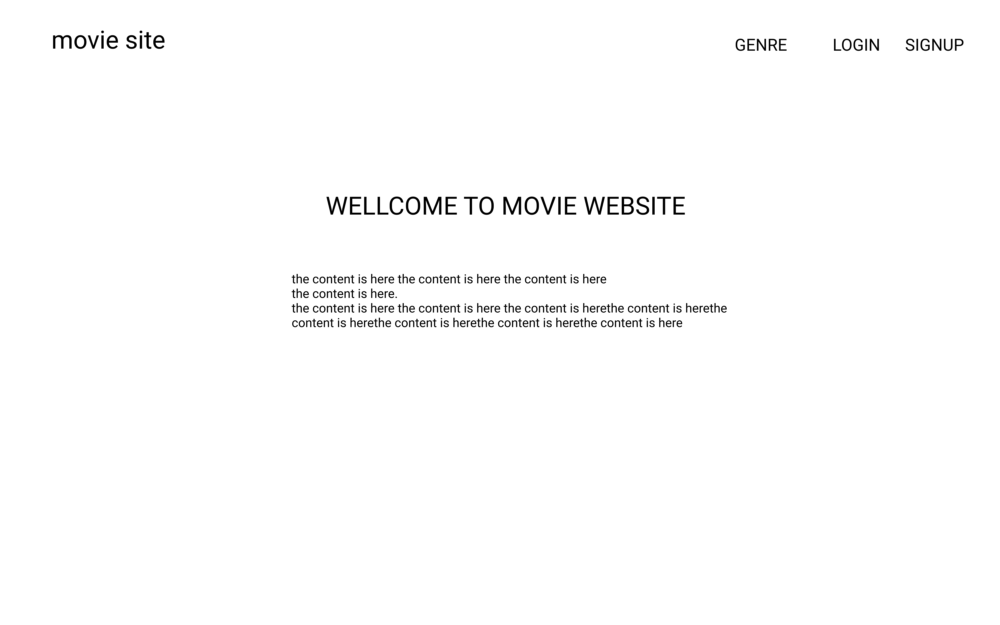
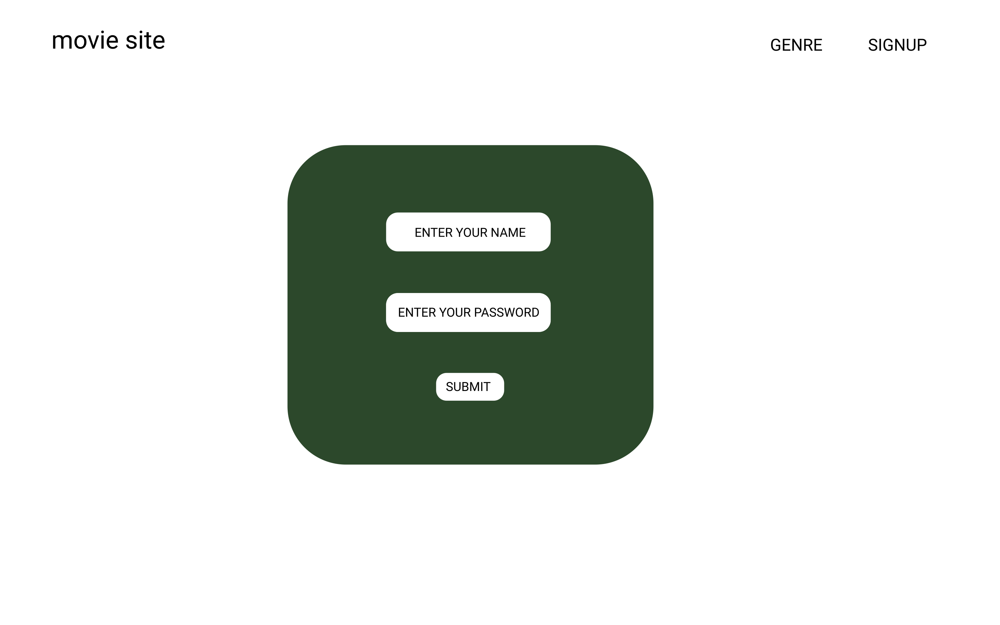
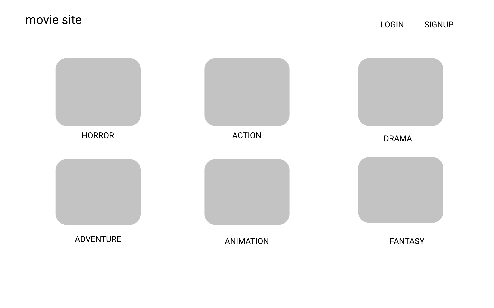
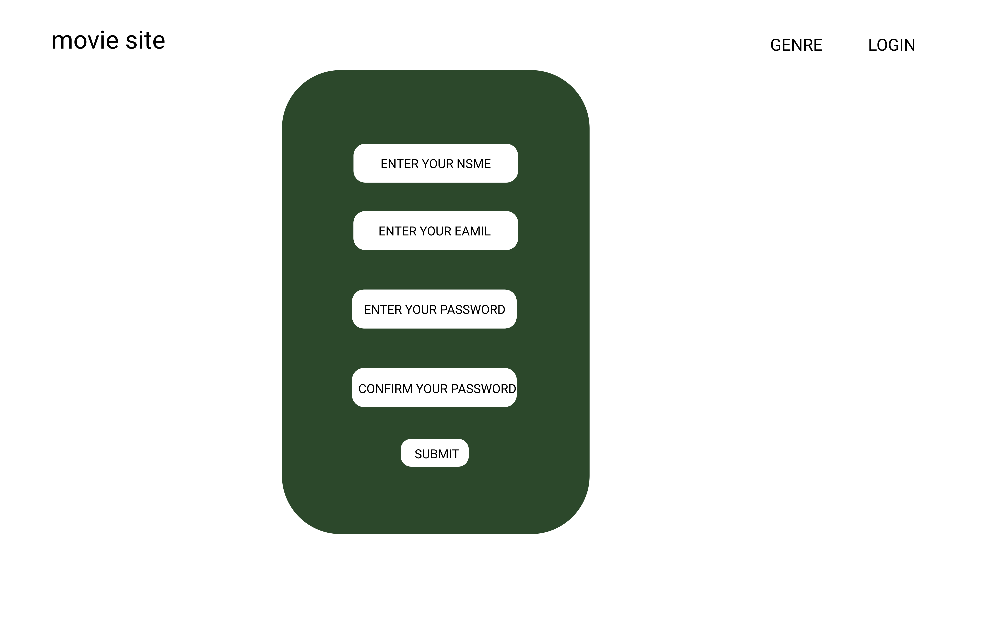
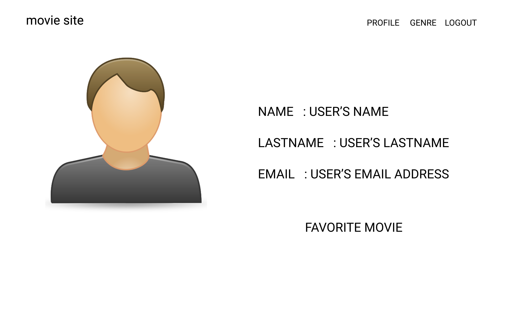
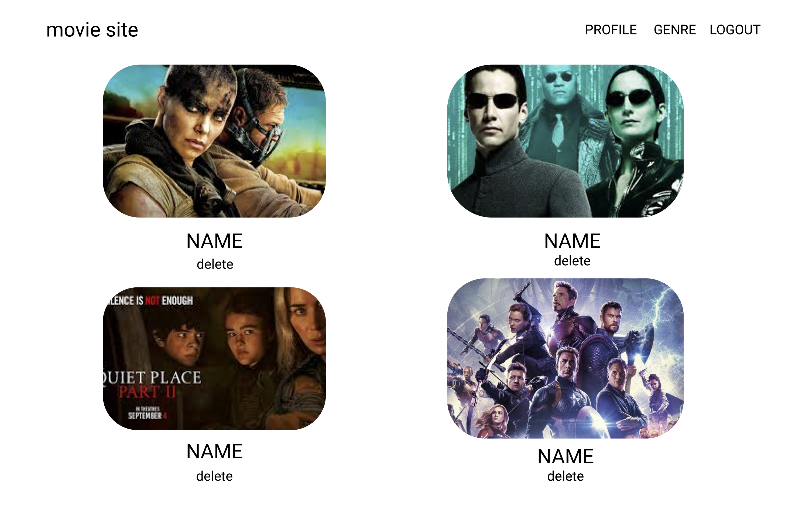
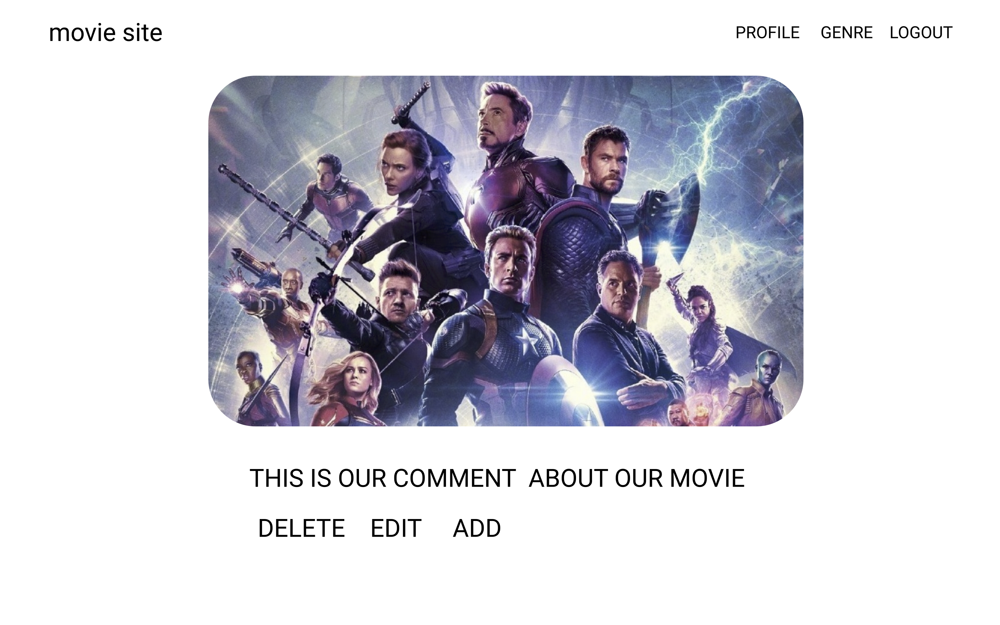
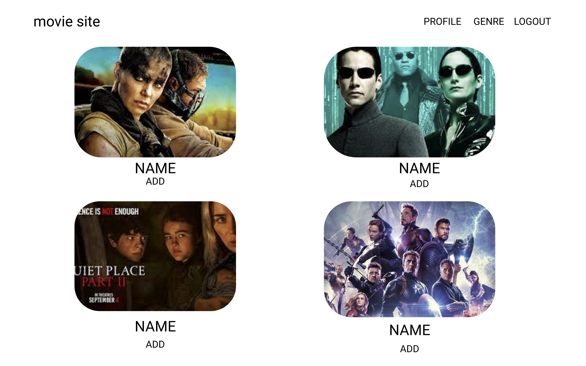

# Moviebook

A movie sharing social media site

## Scope

A website that store ratings, reviews, comments and allows interaction between users

## Technologies

- Django
- AWS
- Bootstrap
- TMDbv3api

## Description

The users will come over to movie-book.com and will have the option to search movies by name or genre from the list of movies imported through the TMDb. They will be able to sign up for an account which will allow them to right 'Reviews' and comments, see others profiles and store lists of their favorite movies. Stretch goals are to incoporate other social media features such as active updating ratings and more social intergration of profiles.

## Pages that can be viewed

- Movie index
- Movie show
- Sign up
- Login
- Profile
- Genres page

## Data Models

We will be using a user model, a profile model a comments model and a photo model. We will also be calling to the TMDb api for movie data to enrich our website.
​
The ERD :

## Wireframes

Wire one

Wire two

Wire three

Wire Four

Wire Five

Wire Six

Wire Seven

Wire Eight

